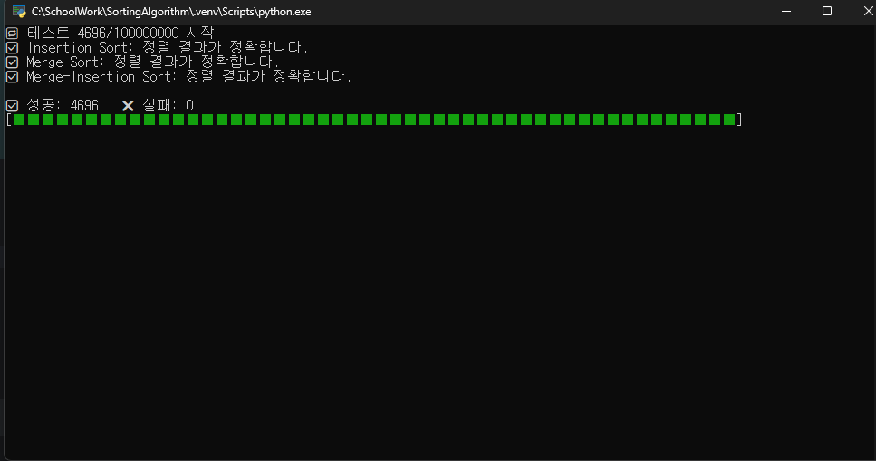
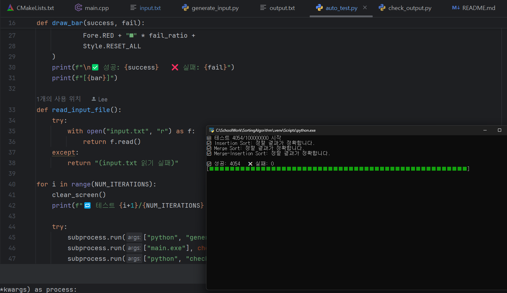

#  Assignment01 - Sorting Algorithm

> 2025-2학기 알고리즘 과제  
> 학번: 2022041069  
> 학년: 2학년  
> 이름: 이인수  
> 지도교수: 강윤석

---

##  프로그램 개요

`input.txt` 파일에 주어진 데이터를 세 가지 정렬 알고리즘을 통해 정렬한 후, 결과를 `output.txt`에 저장하는 프로그램입니다.

---

##  사용된 정렬 알고리즘

- **삽입 정렬 (Insertion Sort)**
- **합병 정렬 (Merge Sort)**
- **삽입-합병 정렬 (Merge-Insertion Sort)**

---

##  파일 구성

| 파일명              | 설명 |
|--------------------|------|
| `main.cpp` / `main.exe` | 세 가지 정렬 알고리즘을 실행하여 `output.txt`에 결과를 저장 |
| `generate_input.py` | 다양한 유형의 테스트 데이터를 생성하여 `input.txt`에 저장 |
| `check_output.py`   | 정렬 결과의 정확성을 검증 |
| `auto_test.py`      | 위 과정을 자동으로 반복 실행하며 테스트 수행 |

> ⚠️ `auto_test.py`는 반복 실행 중 시스템 권한이 필요할 수 있으므로 관리자 권한(sudo)으로 실행하는 것을 권장합니다.

---

##  실행 방법

```bash
# 1. 테스트 데이터 생성
python generate_input.py

# 2. 정렬 알고리즘 실행
main.exe

# 3. 결과 검증
python check_output.py

# 4. 자동 반복 테스트 (권장: 관리자 권한)
sudo python auto_test.py

```
---

### **실행 이미지**

